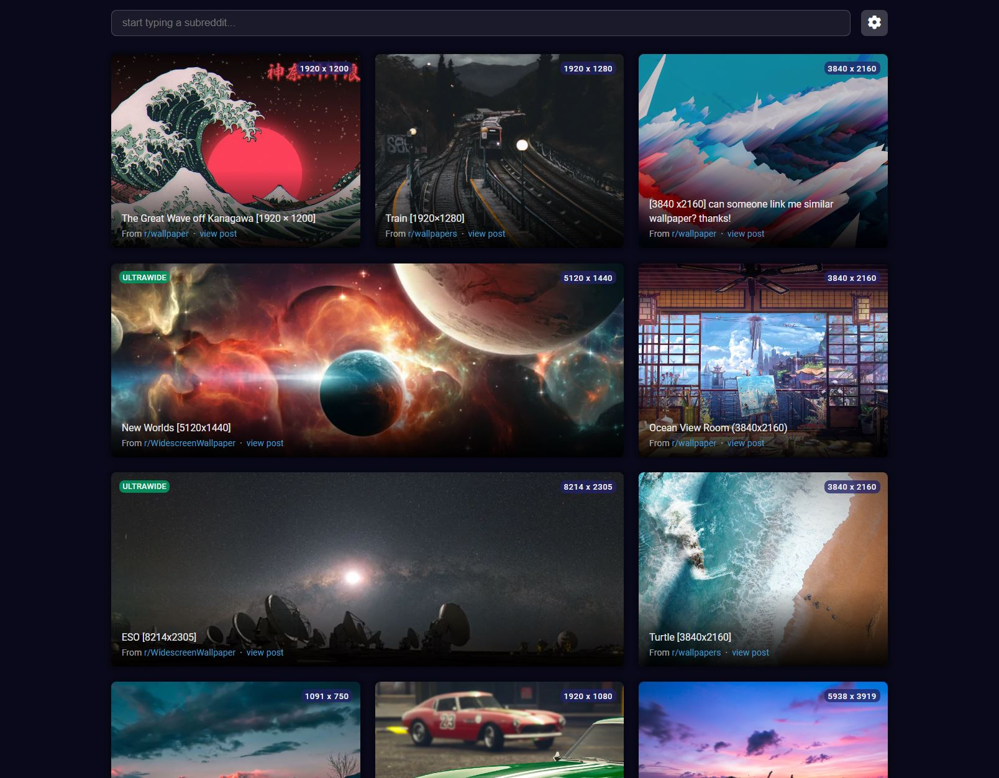

## Getting Started

Install Nodejs from https://nodejs.org/en/download/ and then clone the repository. `cd` into the directory and run following commands.

- Run *`npm install`* 
- Run *`npm start`* 

The project should be running on `localhost:3000`.

To build project run *`npm run-script build`*.

## Preview

